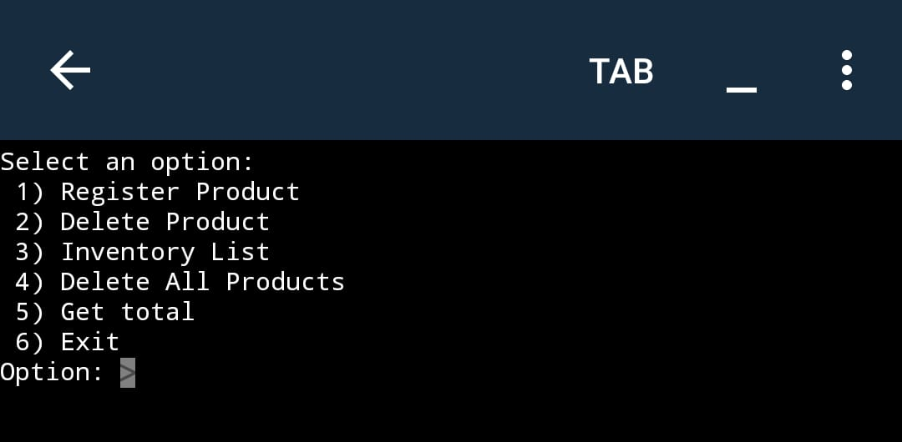
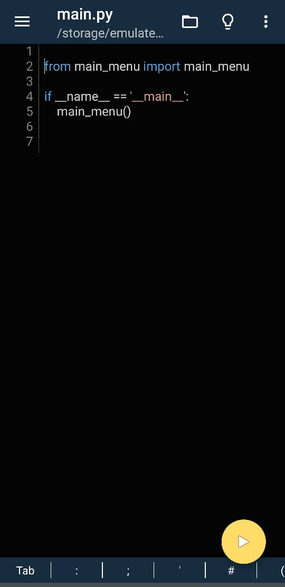

# Product Inventory Management System

## Description

This Python application allows users to manage a product inventory, including registering products, deleting products, viewing the full inventory list, deleting all products, and calculating the total sum of all products. It's designed to give users control over their purchases and maintain an up-to-date inventory.

## How to Get the Code

1. To clone the repository

2. Navigate to the project directory in your terminal.

3. Run the program by executing the following command:

```
python main.py
```

## Features

- **Register Product**: Allows you to add a new product to the inventory.
- **Delete Product**: Lets you remove a product by its name.
- **Inventory List**: Displays a list of all products in the inventory.
- **Delete All Products**: Deletes all products from the inventory.
- **Get Total**: Calculates and displays the total sum of all products in the inventory.

## Project Structure

The project structure is as follows:

```
├── clear.py
├── database
│   └── database.db
├── database_setup.py
├── functions
│   ├── delete_all_products.py
│   ├── delete_product.py
│   ├── exit_program.py
│   ├── get_total_sum.py
│   ├── list_all_products.py
│   └── register_product.py
├── generate_menu.py
├── main_menu.py
├── main.py
├── readme.md
└── show_read_execute.py
```

## Installation and Setup

To get started with the app on your mobile device, follow these steps:

1. **Install the app:**
   - Download and install **Pydroid 3** from the app store or the source provided.

2. **Create a folder and copy the project:**
   - Create a folder on your mobile device and copy the entire project into that folder. Ensure all files are in the correct location so you can open the main.py file from the app.

3. **Run the app:**
   - Open the app on your mobile device and run the `main.py` script from the app interface.

   This will start the application.

Make sure you have Python support enabled on your mobile device to run the script.

## Images



